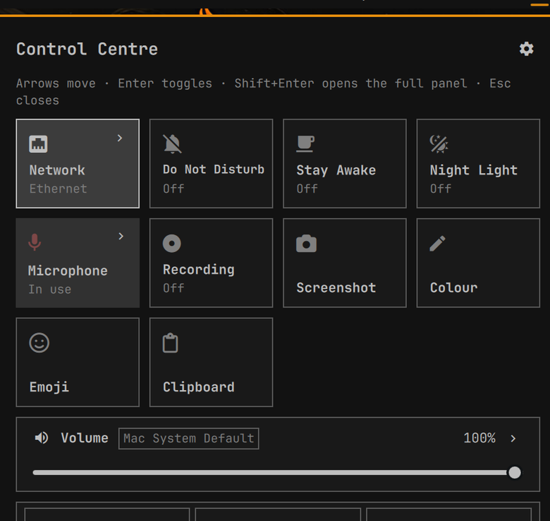

# Control Centre

One key opens every daily system control in a single native Omarchy card:
Wi-Fi, Bluetooth, volume, brightness, night light, Do Not Disturb, stay awake,
power profile, microphone, screen recording, media, and lock/sleep/screensaver.
Anything deeper opens the stock Omarchy panel it belongs to.



## What it does

| | |
|---|---|
| One surface | Thirty-eight controls in one card, on the focused monitor |
| Native | Built from the shell's own components, so it follows your theme exactly |
| Reads at a glance | Your theme's accent marks what is on, so the card answers "what have I left running" without being read |
| Never a duplicate | Wi-Fi lists, Bluetooth pairing, the per-app mixer and monitor layout stay in the stock panels, one chevron away |
| Live both ways | A tile reflects a change made anywhere else, and a change made here shows up everywhere else |
| Keyboard first | Arrows, digits, Tab and Enter reach everything; the mouse does too |
| Adapts | A control whose hardware is missing is hidden, not greyed out |
| Yours to arrange | Show, hide and reorder anything from the card itself, no file editing |

## Install

```sh
omarchy plugin add https://github.com/jesse-chelin/omarchy-control-centre --enable
```

A launcher icon appears in your bar straight away. For a keyboard shortcut,
open the card, press `,` for edit mode, and set one under **Keyboard
shortcut**: click it, press the combination you want, and it is written into
`~/.config/hypr/bindings.lua` and live immediately.

It writes one clearly marked block and leaves the rest of that file alone, and
it keeps a copy of the file as it was in
`~/.config/hypr/bindings.lua.before-control-centre`. Delete the three marked
lines to be rid of it, or clear the shortcut from the card with Backspace.

Two things about capturing a shortcut are worth knowing. A combination that is
already taken cannot be pressed into the field at all, because Hyprland
consumes it before any window sees it, so the card checks the binding list and
names what holds it instead. And the number row is not offered: Hyprland does
not report which digit its workspace bindings use, so a digit combination
cannot be checked, and on Omarchy those are the workspace switches.

If you would rather write it yourself:

```lua
o.bind("SUPER + BACKSLASH", "Control Centre", "omarchy-shell shell toggle io.github.jesse-chelin.control-centre")
```

A launcher icon also appears in the bar, so the card is one click away
without a keybinding. It behaves like the stock bar icons: the card opens
under it, the icon takes the accent mark while the card is up, and opening
another bar panel puts it away (and the other way round). Turn it off with
**Bar pill** in the card's edit mode.

## Keys

| Key | Action |
|---|---|
| Arrows, `h` `j` `k` `l` | Move between tiles |
| Wheel | Scrolls a long card; over a slider on a card that fits, changes its value |
| Enter, Space | Flip the control under the cursor |
| Shift+Enter, `o` | Open the stock panel behind the tile |
| Left, Right, `+`, `-` | Move a slider by one step, or pick within a tile |
| Shift + those | Move a slider by five steps |
| `1` to `9` | Flip the nth toggle directly |
| Tab, Shift+Tab | Jump between sections |
| `,` | Edit mode: show, hide and reorder controls, and change settings |
| Ctrl+arrows | In edit mode, move the control under the cursor |
| Esc | Leave edit mode, then close |

## The controls

Thirty-eight of them. Every one reads or writes the same thing the matching
stock Omarchy panel, bar indicator or menu entry does, so the card and the
rest of the desktop never disagree. Sixteen are on when you install it; the
rest are one keystroke away in edit mode.

| Group | Controls |
|---|---|
| Connectivity | Wi-Fi, Bluetooth |
| Sound | Volume, Mic Level, Microphone mute |
| Display | Brightness, Night Light, Warmth |
| Focus | Do Not Disturb, Stay Awake, Screensaver, Crash Capture |
| Capture | Recording, Screenshot, Color Picker, Grab Text, Scan QR |
| Tools | Emoji, Clipboard, Reminder, Share, Transcode, Net Speed, Disk Speed |
| Desktop | Menu Bar, Window Gaps, Square Ratio, Scrolling layout, Theme |
| Hardware | Touchpad, Touchscreen, Laptop Screen, Mirror, Hybrid GPU |
| Power | Power profile and battery |
| Media | Now playing with transport |
| System | Lock, Sleep, Screensaver; Log Out, Restart, Shut Down, Hibernate |

A control hides itself when the machine cannot back it: no Bluetooth adapter,
no backlight, no battery, no touchscreen, nothing playing. A chevron hides
itself when the stock panel it would open is not in your bar, because the
shell can only summon a panel that is mounted there. Anything that ends the
session or the machine asks twice: it arms on the first press, says so, and
only goes through on a second press within two seconds.

Wi-Fi, Bluetooth, Volume, Microphone, Brightness and Power each open their
stock panel from the chevron, for the network list, pairing, the per-app
mixer and monitor layout. The card never tries to replace those.

## Making it yours

Press `,` or click the gear. Your card comes first, in the order it actually
uses, and everything else sits below it grouped by what it does.

Drag a control to move it, and a line shows where it will land. Two narrow
controls sit side by side, so between them the line stands up and marks which
side you are on. A full-width control takes a whole row, so it can only go
above or below, and so can anything dropped onto one: there the line lies flat
across the card. Drag one up from the groups below and it joins your card
where you dropped it; drag one down among the hidden ones and it leaves.
Dragging near the top or bottom scrolls the list while you hold it. Enter or a click shows and hides the one under the
cursor, and Ctrl with the arrows moves it for anyone who would rather not
drag. The card saves as you go.

Clicking away while you are arranging leaves edit mode rather than closing the
card, which is what Escape does too. A second click, or a second Escape,
closes it.

## Settings

Under the Settings heading in edit mode: the card can open at the bar end or
in the centre, it can run at comfortable or compact density, all animation can
be turned off, and the bar pill can be turned off. Compact drops the state
line from the square controls and tightens every row, which is what to reach
for on a small laptop. **Centre** is honoured however the card was
opened; **Bar end** means under the bar icon when you click it, and at the end
of the bar when you press the key. Everything is saved as you change it.

State lives in `~/.local/state/omarchy/control-centre.json`, written with mode
0600. Delete it to start over; the card re-reads it every time it opens.

## Trust boundaries

The card runs inside a process that lives as long as your session, so the
places where something outside it gets a say are deliberately narrow.

**No network, no credentials, no privilege.** The plugin makes no network
requests, holds no tokens, and installs nothing.
No sudo or pkexec is required, and neither is ever invoked.

**Your Hyprland config.** Setting a shortcut from the card writes one marked
block to `~/.config/hypr/bindings.lua`. That is the only file this plugin
touches that it does not own, so: the combination is validated against a fixed
grammar of modifiers and key names in the writer itself, whatever the card
claims to have checked; only the text between the two markers is ever
replaced, and every other byte of the file is copied through; the file is read
with `O_NOFOLLOW` under a size cap and refused if it is a symlink, not a
regular file, or owned by someone else; the new contents go to a private temp
file in the same directory, are fsynced, and are renamed into place, so an
interrupted write cannot leave a config Hyprland fails to parse; and a copy of
the file as it was is kept beside it the first time. `tests/test_keybind.py`
builds each hostile case and checks the refusal.

**The settings file.** It sits in a directory anything running as you can
write, so it is read and written by `state.py` rather than by QML, which has
no way to cap what it reads. Reading opens with `O_NOFOLLOW`, and refuses a
symlink, anything that is not a regular file, anything owned by another user,
and anything over 64 KiB. Writing creates a private temp file with the mode
set at creation, fsyncs it, renames it into place, fsyncs the directory, and
refuses to replace anything that is not a regular file. Whatever survives the
read is then rebuilt field by field against the same bounds it is written
under: an unknown tile id is dropped, a missing one is added, and a value
outside its allowed set falls back to the default. A file that is refused
costs you your layout, not your session; the card opens on defaults and says
why.

**The child processes.** Omarchy commands for the things QML cannot read or
do directly: the monitor state, power profiles, battery status, the audio
sink, whether a recording is running, and one `probe.sh` that reads every
toggle flag, hardware answer and theme name in a single pass rather than one
child per control. Every command a control can run is a literal argument
vector in a table in `Model.js`, so the complete set of things this plugin can
execute is a list you can read in one sitting. Each runs with a cleared
environment holding only the variables those scripts need, with a fixed
argument vector that is never built by string concatenation, under a watchdog
that sends `TERM` and then `KILL`. Every value that reaches an argument vector
is validated first against an allowlist or a pattern: a monitor name, a
PipeWire node name or id, a power profile, a percentage. Every byte read back
is parsed within a bound.

**Nothing runs while the card is closed.** Every timer is bound to the card
being open, which is verifiable: with the card closed, no probe process is
ever spawned.

## Removal

```sh
omarchy plugin remove io.github.jesse-chelin.control-centre
rm -f ~/.local/state/omarchy/control-centre.json
```

Then remove the binding you added to `~/.config/hypr/bindings.lua` and run
`hyprctl reload`. If you turned the bar pill on, `omarchy bar` no longer lists
it once the plugin is removed. The plugin registers nothing with any service,
holds no credentials, starts no daemon, and leaves nothing else behind.

## Development

```sh
./check.sh
```

Runs the manifest validation, `qmllint`, the model unit tests, the structural
scans `qmllint` misses, the settings-file tests and the glyph check. It is the
same command CI runs.

The card exposes its whole state machine over IPC, because keyboard focus
inside a layer-shell surface cannot be synthesised from outside:

```sh
id=io.github.jesse-chelin.control-centre
omarchy-shell shell call $id stateJson ""
omarchy-shell shell call $id setCursor volume     # -1 if that tile is not showing
omarchy-shell shell call $id moveBy "0,1"
omarchy-shell shell call $id pressKey enter       # or shift+enter, escape, left, ...
omarchy-shell shell call $id setEditMode true
omarchy-shell shell call $id dropTile "volume,wifi"   # the drop half of a drag
```

`keepLoaded` overlays are held by a `Loader` keyed on the source URL, so edits
to the QML need `omarchy-restart-shell` to take effect.

`NOTES.md` records what was measured on the running system while this was
built, and is worth reading before changing how a tile reads its state.

## License

MIT
